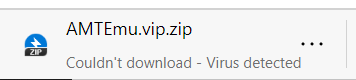
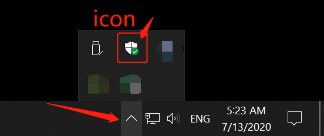

# Fix the Windows Defender For Windows 10 and 8 (Easy Guide)

How to safely fix the "virus detected" problem when you download a file (without turn-off the windows defender).

**Works for *Chrome, Firefox, Internet Explorer, Microsoft Edge*  etc.**

-------------------------------------

For example, you may want to download a file:

However, your browser doesn't like it (actually it is Windows Defender that doesn't like it).

Many online tutorials said you need to turn-off the Windows Defender which is not very safe. Here we only want to trust this file.
Now what you need to do is 

1. Right click the windows defender's icon located at the bottom bar of your screen. Click "***View Secuirity Dashboard***".

2. Click "***Virus & threat protection***".

3. Click "***Protect history***".

4. Click the latest report.

5. Click on the ***Actions -> Allow*** and make sure the reported file name is correct.

6. Download again you will be fine. If more "Virus detected" reported, repeat the above steps and problem will be resolved.

